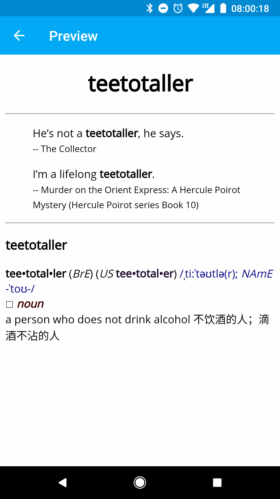

# Export Kindle Vocabulary Builder to Anki

Kindle Vocabulary Builder is useful, as it collects new words automatically when you read books. However, it has only two decks: "Learning" and "Mastered". It lacks a lot of functionalities found in professional flashcard software like Anki. Kindle Vocabulary Builder stores all the data in `/system/vocabulary/vocab.db` SQLite3 database. This repo contains helpers to extract words from Kindle Vocabulary Builder and import them into Anki.

## Usage

1. Install requirements from `requirements.txt`.
2. Use [DeDRM Tools](https://github.com/apprenticeharper/DeDRM_tools) to strip DRM if your Kindle dictionary is protected by DRM.
3. Use [KindleUnpack](https://github.com/kevinhendricks/KindleUnpack) to unpack your Kindle dictionary into raw HTML files.
4. Run `./convert_dict.py mobi7/book.html dict.tsv` to convert the HTML dictionary into a TSV dictionary.
5. Run `./convert_vocab.py vocab.db dict.tsv notes.tsv` to extract words from Kindle Vocabulary Builder, add definitions to them, and save them into a TSV Anki notes file.
6. You can now import the `notes.tsv` file into Anki.

## File Formats

*TSV* stands for [Tab-seperated vlues](https://en.wikipedia.org/wiki/Tab-separated_values). The fact that there are unlikely any `\t`s in dictionary definitions or book citations, makes TSV a better choice than CSV for both plain-text dictionaries and Anki notes.

The TSV dictionary generated by `convert_dict.py` has two columns, Stem and Definition. You can use `--expand-iform` flag to make every inflectional form its own entry (e.g. abandon, abandoned, abandoning, abandons would be four entries with same definitions). The generated file would be much larger.

The TSV dictionary could also be used in Kindle Mate.

The TSV Anki notes file has three columns: Stem, Usage, Definition. You can map them to whatever fields you like. The "Usage" and "Definition" columns are HTML, so remember to check "Allow HTML in fields" when importing into Anki. The "Usage" column contains all the citations in Kindle Vocabulary Builder, i.e. if you look up a word in different books, the usage sentences will be merged into one single Anki note.

## Templates and Styling

The templates and styling below make the rendered Anki cards very similar to their counterparts in Kindle Vocabulary Builder.



Front Template:

```HTML
<h1>{{Word}}</h1>
<hr>
{{Usage}}
```

Back Template:

```HTML
{{FrontSide}}
<hr>
{{Definition}}
```

Styling:

```CSS
h1 {
 text-align: center;
}
blockquote small:before {
 content: " -- ";
}
```

## Similar Projects

- [Kindle2Anki](https://github.com/NdYAG/Kindle2Anki)
- [Kindle Mate](http://kmate.me/download/)
